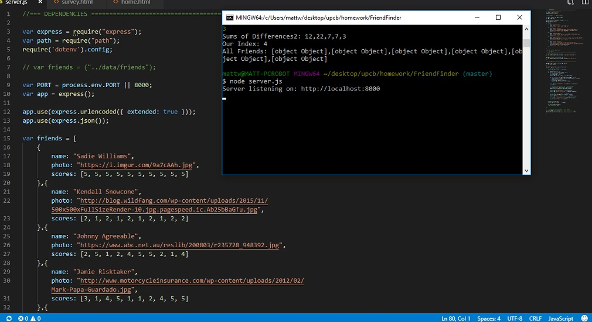
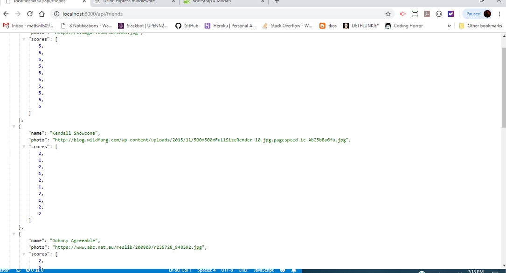
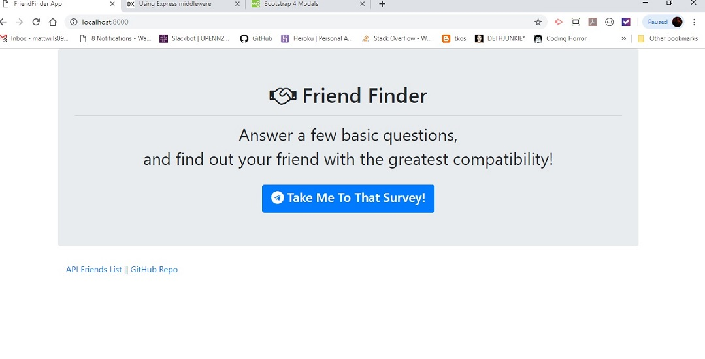
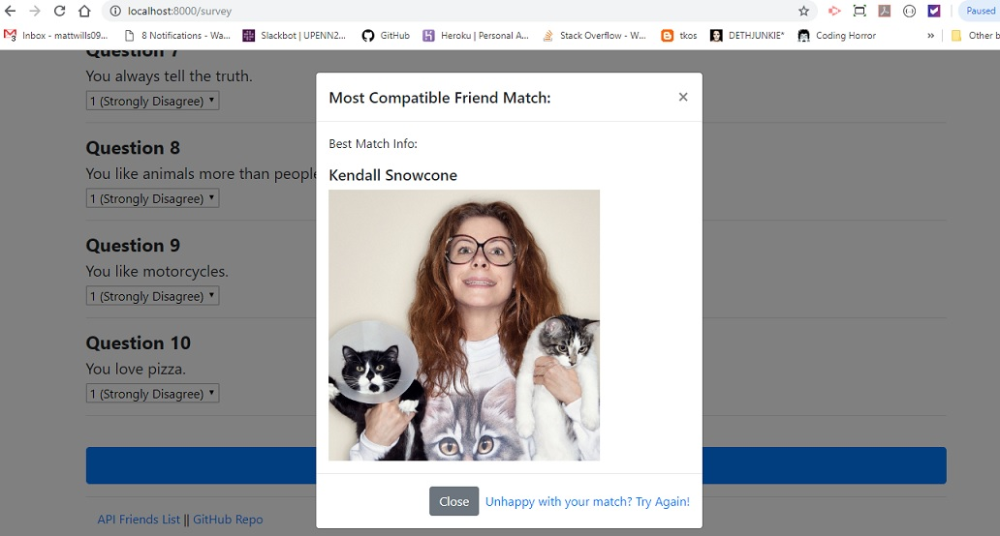
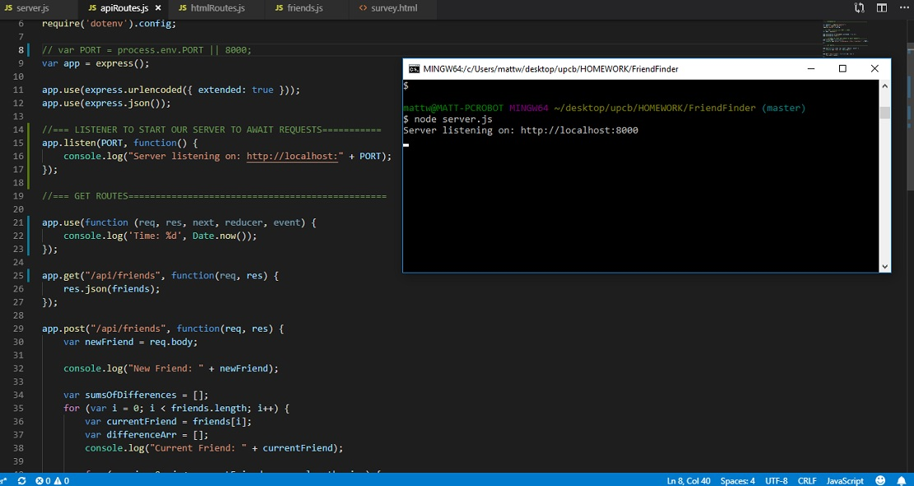

# "Friend Finder" Compatibility Application!
___

For this application, a social media type compatibility app was created using HTML, JavaScript, Bootstrap, Routes, Node JS, Express JS for the site, and Heroku for the app web hosting.  There was also a GitHub repository made for the project, and in the page footer - links are provided to access the full API Friends List, and the GitHub repository link.  The application is modeled off of a few social media sites, and is basically a Friend Compatibility Finder that will allow users to complete a simple hard coded survey, and then by using that information and values on the back end, the user will be matched with a friend (or user) that has the most similar score in terms of answer values.  The scores are recorded from the survey form in the form of an array, and then using the differences of each score (value) in each array, was then matched with the user using the least amount of difference in their scores as the deciding factor (sounds confusing I know, haha).

Completing each of the 'home.html' and 'survey.html' pages were fairly easy using HTML, Bootstrap, CSS, and past project examples.  But some problems I had encountered were mainly typos in collecting the values of each dropdown answer, but those were easily rectified with Bryan and Aaron's help.  Also, the modal box at the bottom of the 'survey' page did take a little tinkering with to have it show properly and be formated correctly.  Simply re-writing the code for the modal using the Bootstrap site corrected those small issues.

In the server.js file, requiring ExpressJS and Paths, connecting to the server port, adding the server listener, and the app.GET and app.POST routes were the easiest parts from working on past projects.  However, other bugs did arise (as you can imagine), as the main problems came up in the server.js file, and the functions and loops inside the POST route.  Basically, the functions that would take each answer array (hard coded and also added by the new user), and then parseing that array, totalling the entire value array, comparing it with each previously added user's array, getting the index of each array, and then by using the difference, matching the user with the correct friend index value to the new user that would be most similar.  I received help from Bryan in setting up the beginning of this, and used a number of sites online to try and get it working, but was only able to get the main structure of the code down.  Sitting with a colleague after class helped me out most, in being able to have someone walk through each part of the functions and code, and then going through the code to have it work its way down and perform properly.

The other addition to the site was being sure that each pre-coded and added user array would be posted to the API Friends List as a new object (that is also provided in the screenshots below).  In the end, the application did function as required, with diffent types of answers giving me different friend matches, and even matching new users with users that were not hard-coded in, and as an example, I had added five friend arrays to be the starting point, and then added a number of new users to the friend array.  Lastly, I did try to research and use a separate app.USE route and split up the code, however, I was not able to get that working before the submission time for this project.  Still, I was able to have the server connect and read from the friends list, but could not get the pages to fully connect when I split up the routes and code.  There will also be a screenshot added of the code I was using the bug I was getting.  Also, in the future, I plan to talk to Bryan or another colleagues regarding the use and implementation of a separate USE route.
___
Working Screenshots:

___

___

___

___
app.Use bug screenshot:

## Built With

* [HTML]
* [JavaScript]
* [Bootstrap]
* [jQuery]
* [Node JS]
* [Express JS]
* [Heroku](https://warm-island-74595.herokuapp.com/) - For public hosting

## Authors

* **Matt Williams** - *Initial work* - [M Williams Portfolio](https://mattwills09.github.io/portfolio.html)
